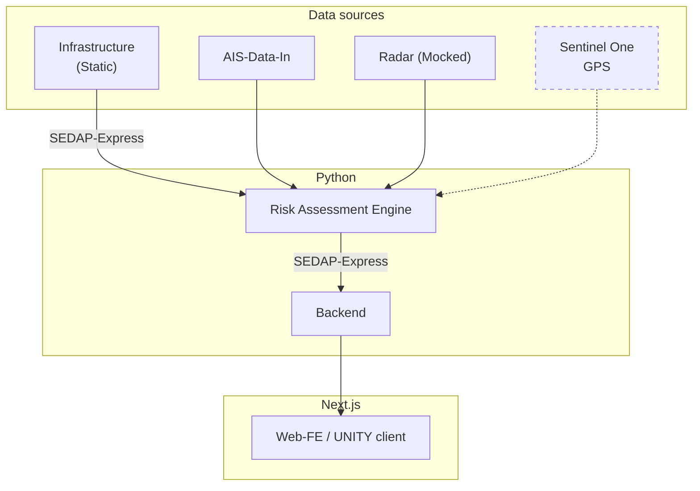

# EDTH-ctrl_sea
Eurpean Defense Tech Hackathon

## Project structure

## Date Sources

### AIS Data
Automatic Identification System (AIS) data provides real-time information about vessel movements, including position, speed, and course. This data is crucial for tracking maritime traffic and identifying potential threats. We are using aisstream.io as our primary source for AIS data.

### Critical Infrastructure Data
Data on critical maritime infrastructure, such as ports, oil rigs, and naval bases and underwater cables. Using a static dataset.

## Aggregators

### Risk Assessment

Indicators:
- Proximity to critical infrastructure
- Amount of historical proximity
- Time close to critical infrastructure
- Multiple trips close to the same infrastructure
- Type of vessel
- Speed of vessel
- Course changes
- AIS signal status (on/off)
- Gaps in AIS data (high)

Calculate a risk score based on these indicators using a weighted formula.

### User Feedback loop
Allow users to provide feedback on risk assessments to improve the model over time in binary fashion (thumbs up/down). This feedback can be used to adjust the weights of the indicators in the risk assessment formula.

